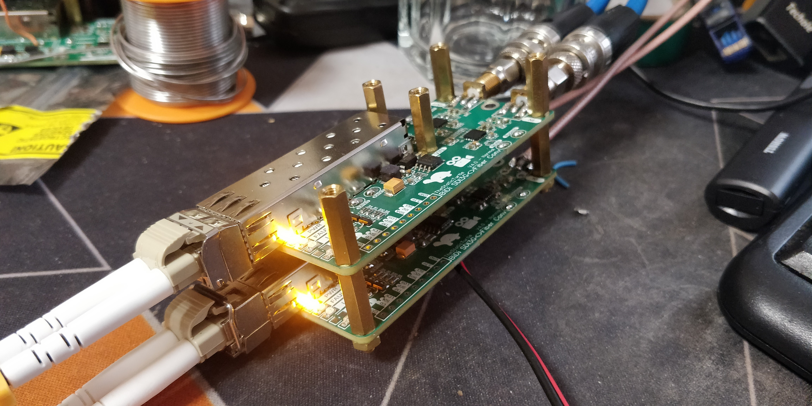

# oshw-sdi3g-fiber

An affordable and open source bidirectional 3G-SDI to Fiber converter.

See https://blog.thestaticturtle.fr/diy-opensource-bidirectional-sdi-to-fiber-converter/ for the full details

*Note: This project was designed with EasyEDA*

[Licensed under MIT](LICENSE)